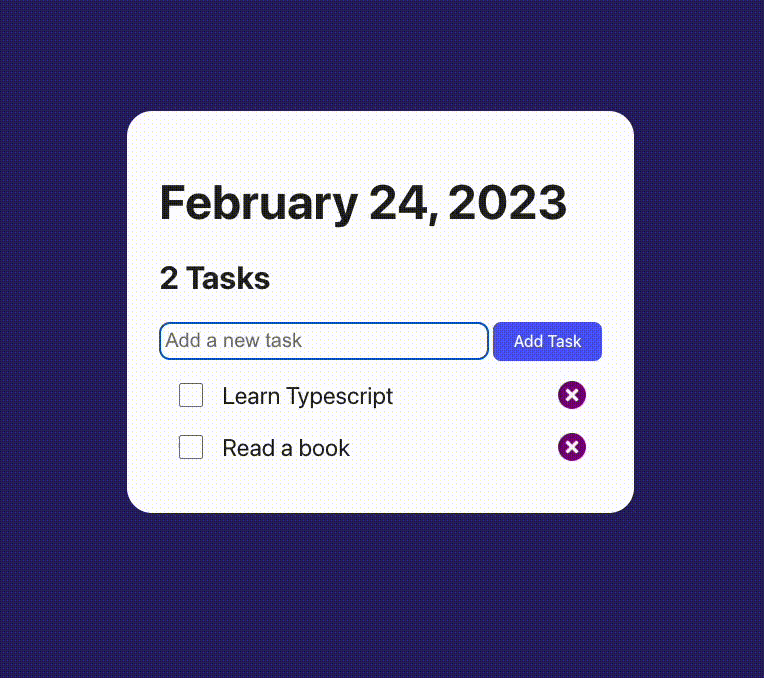

# To-Do-List

typescript mini project, to-do-list holds a list of tasks that needs to be completed.

## Screenshot



## Key Features

- Add new tasks
- Delete tasks
- Mark tasks as completed
- Save tasks in LocalStorage

## Tech

- Typescript
- Sass
- DOM manipulation
- Vite

## Installation

1. Install dependencies

```bash
  npm i
```

2. Run the code

```bash
  npm run dev
```
